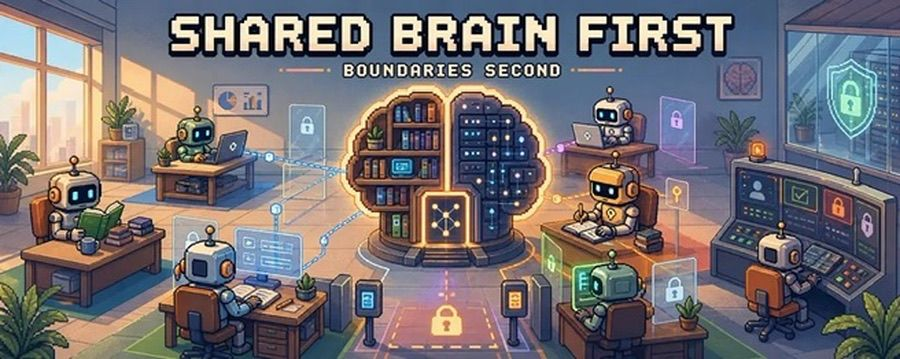
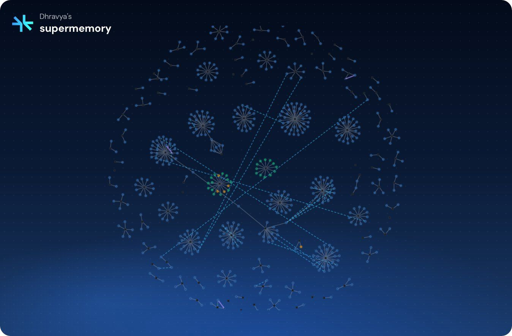

<div align="center">



# 🧠 Company Brain

### One brain for every agent in your company.

**Local-first memory engine that unifies Microsoft Fabric IQ, Work IQ, and Foundry IQ into a single Postgres + pgvector store — and serves it to any agent over one API.**

[](LICENSE)
[](https://www.python.org/)
[](https://www.postgresql.org/)
[](https://github.com/pgvector/pgvector)
[](https://fastapi.tiangolo.com/)
[](https://www.microsoft.com/fabric)
[](https://learn.microsoft.com/graph)
[](https://ai.azure.com)
[](CONTRIBUTING.md)

[**Quickstart**](#-30-second-quickstart) · [**Architecture**](#-architecture) · [**Connectors**](#-connectors) · [**API**](#-api) · [**Roadmap**](#-roadmap) · [**FAQ**](#-faq)

</div>

---

## ✨ Why Company Brain

Microsoft's "IQ" surfaces are powerful, but **siloed**:

| Surface | What it knows | What it can't do |
|---|---|---|
| **Fabric IQ** | Your data warehouse, lakehouses, semantic models | Can't see your inbox |
| **Work IQ** (Copilot/Graph) | Your mail, Teams, SharePoint, calendar | Can't see your data ontology |
| **Foundry IQ** | Your AI project knowledge bases | Can't see either of the above |

None of them talk to each other. None of them give **you** raw access to facts, embeddings, or a unified retrieval layer. Your agents end up with three half-brains, none of them yours.

**Company Brain** is the missing piece: a small, opinionated `MemoryStore` interface that ingests all three sources, extracts atomic facts, stores them in your own Postgres, and serves them to any agent — over one HTTP API, on your machine, with your keys.

> **Shared brain first. Boundaries second.**
> Your data stays under your tenant. Your agents share one memory. Permissions are enforced by `container_tag` at query time, not by data duplication.

---

## 🚀 30-second quickstart

```bash
# 1. Tools
brew install uv docker gh
open -a Docker

# 2. Project
git clone https://github.com/ZaltaClaw/company-brain.git ~/projects/company-brain
cd ~/projects/company-brain
uv sync
cp .env.example .env          # fill in values — see CLAUDE.md

# 3. Boot the brain
./scripts/init-db.sh          # postgres+pgvector on :5433
uv run company-brain status

# 4. Ingest + query
uv run company-brain ingest all
uv run company-brain search "what did I work on with Michal last week"
```

Full setup walkthrough lives in [**CLAUDE.md**](./CLAUDE.md) — written so Claude Code (or any agent) can finish the install on a fresh org Mac without human help.

---

## 🏗 Architecture

```
  ┌──────────────┐    ┌──────────────┐    ┌──────────────┐
  │  Fabric IQ   │    │   Work IQ    │    │  Foundry IQ  │
  │ (warehouse,  │    │ (mail, teams,│    │ (AI project  │
  │  lakehouses) │    │  sharepoint) │    │  knowledge)  │
  └──────┬───────┘    └──────┬───────┘    └──────┬───────┘
         │                   │                   │
   fabric_iq/            work_iq/           foundry_iq/
    ingest.py             ingest.py           ingest.py
         │                   │                   │
         └───────────────────┼───────────────────┘
                             ▼
                    ┌────────────────┐
                    │  extraction.py │  ← OpenAI structured output
                    │  embeddings.py │  ← text-embedding-3-small
                    └────────┬───────┘
                             ▼
                  ┌────────────────────┐
                  │    MemoryStore     │  packages/core
                  │  Postgres + pgvec  │  cosine search
                  │  container_tag RBAC│
                  └─────────┬──────────┘
                            │
                  ┌─────────▼──────────┐
                  │      FastAPI       │  apps/api
                  │ /v1/add  /v1/search│
                  │      /v1/profile   │
                  └─────────┬──────────┘
                            │
            ┌───────────────┼───────────────┐
            ▼               ▼               ▼
        Hermes         Claude Code        Cursor
       (or anything that speaks HTTP)
```

Every memory row carries a `container_tag` like `fabric:<workspaceId>:<lakehouseId>`, `work:<userId>`, or `foundry:<projectId>` so you can scope, filter, and govern searches per source.

---

## 🔌 Connectors

| Connector | Source | Pulls | Auth |
|---|---|---|---|
| `fabric_iq` | Microsoft Fabric REST + SQL endpoint | Workspaces, lakehouses, table schemas, sample rows, semantic-model FK graph (the "ontology") | MSAL service principal |
| `work_iq` | Microsoft Graph | Outlook mail, Teams channel messages, OneDrive recent docs, calendar events | MSAL service principal **or** device-code flow |
| `foundry_iq` | Azure AI Foundry | Projects, knowledge indexes, docs, chunks | `DefaultAzureCredential` (works with `az login`) |

Each connector lives in `connectors/<name>/` with its own `README.md`, `client.py`, `ingest.py`, and (where relevant) `auth.py` + `webhooks.py`. Real Microsoft endpoints, real auth flows, no mocks.

### Add your own connector

The interface is one method:

```python
from company_brain.store import MemoryStore

def ingest(store: MemoryStore):
    for record in pull_from_my_source():
        store.add(
            content=record.text,
            container_tag=f"my-source:{record.id}",
            metadata={"source_url": record.url, ...},
        )
```

Drop it under `connectors/<name>/ingest.py`, register the command in `cli.py`, and you're done.

---

## 📡 API

```bash
uv run uvicorn apps.api.main:app --port 8088
```

| Method | Endpoint | Purpose |
|---|---|---|
| `POST` | `/v1/add` | Insert a document — auto-extracted into atomic facts, embedded, indexed |
| `POST` | `/v1/search` | Hybrid semantic search across the brain, filterable by `container_tag` prefix |
| `POST` | `/v1/profile` | Build a fresh "user profile" — static facts + dynamic recent activity |
| `GET` | `/v1/documents` | List + paginate stored documents |
| `GET` | `/healthz` | Liveness check |

Example:

```bash
curl -X POST http://localhost:8088/v1/search \
  -H 'content-type: application/json' \
  -d '{"query":"sales pipeline architecture","container_tag":"fabric:","limit":5}'
```

---

## 🧰 What's in the box

```
company-brain/
├── packages/core/company_brain/   # MemoryStore + Postgres impl + extraction + embeddings + CLI
├── connectors/
│   ├── fabric_iq/                 # Fabric REST + ontology graph
│   ├── work_iq/                   # Microsoft Graph (mail, teams, drive, calendar)
│   └── foundry_iq/                # Azure AI Foundry knowledge indexes
├── apps/api/                      # FastAPI HTTP wrapper
├── vendor/supermemory/            # ⬅ Supermemory dashboard, MCP, browser ext (git submodule)
├── scripts/                       # init-db, ingest-all, status
├── docker-compose.yml             # pgvector/pgvector:pg16 on :5433
├── CLAUDE.md                      # full handoff doc for Claude Code / any agent
└── README.md
```

### Supermemory dashboard (vendored)

The upstream [Supermemory](https://github.com/supermemoryai/supermemory) repo is pinned as a **git submodule** at `vendor/supermemory/` so you get their dashboard, MCP server, browser extension, and Raycast extension out of the box.

By default the dashboard points at hosted `api.supermemory.ai`. Flip it at your local Company Brain API by editing `vendor/supermemory/apps/web/.env`:

```bash
NEXT_PUBLIC_BACKEND_URL=http://localhost:8088     # your local Company Brain
```

Then:

```bash
cd vendor/supermemory && bun install && bun run dev    # dashboard on :3000
```

#### Memory graph viz

The vendored `apps/memory-graph-playground` is wired to render Company Brain's
local data — no Supermemory cloud account needed. Our FastAPI exposes a
Supermemory-compatible `POST /v3/documents/documents`, and a runtime patch
points the playground at `http://localhost:8088` instead of `api.supermemory.ai`.

```bash
./scripts/run-playground.sh    # opens graph viz on :3004 wired to your local brain
```

The patch lives at `vendor-patches/memory-graph-playground.patch` and is applied
at runtime by `scripts/apply-vendor-patches.sh`, so the submodule pointer never
moves. Override the brain URL with `COMPANY_BRAIN_URL=...` if you run the API
on a non-default host/port.



The `stores/supermemory.py` adapter lets you flip the engine the other way too — keep the Supermemory dashboard pointed at *their* hosted brain and use Company Brain just for governed local ingestion. Either direction works; pick whichever side of the boundary you want to own.

To clone with submodules:

```bash
git clone --recurse-submodules https://github.com/ZaltaClaw/company-brain.git
# or if you already cloned:
git submodule update --init --recursive
```

---

## 🛡 Design principles

1. **Local-first.** No data leaves your machine except for source APIs (Microsoft) and OpenAI embeddings + extraction. No third-party memory SaaS.
2. **One interface, swappable backend.** `MemoryStore` is an ABC. Postgres+pgvector is the default; adapters for hosted Supermemory, mem0, MemClaw ship as stubs you can fill in.
3. **Container tags as RBAC.** Every row is scoped (`fabric:`, `work:`, `foundry:`, or anything custom). Searches filter by prefix. No cross-tenant bleed.
4. **Real auth, no shortcuts.** MSAL for Microsoft, `DefaultAzureCredential` for Azure, device-code fallback for laptop dev. No fake tokens.
5. **Structured extraction.** Facts come out of OpenAI as a Pydantic schema — `{fact, confidence, temporal_validity, type}` — not free-text blobs.

---

## 🗺 Roadmap

- [x] Postgres + pgvector store with cosine search
- [x] Fabric IQ connector (workspaces → lakehouses → tables → ontology)
- [x] Work IQ connector (mail, Teams, OneDrive, calendar)
- [x] Foundry IQ connector (projects → knowledge indexes)
- [x] FastAPI HTTP layer
- [x] CLI (`init-db`, `ingest`, `search`, `profile`, `status`)
- [ ] Graph change-notification webhooks for real-time Work IQ sync
- [ ] Hermes Agent memory-provider plugin (auto-wire Company Brain as Hermes's memory tier)
- [ ] Claude Code skill (`/brain` slash command)
- [ ] Web dashboard for browsing + reviewing memories
- [ ] Multi-user `container_tag` enforcement at the API layer (JWT-scoped)
- [ ] MemClaw adapter (governed cross-fleet episodic tier)

---

## ❓ FAQ

**Why not just use Supermemory hosted?**
You can — there's an adapter stub. But "Company Brain" specifically means *your* brain, on *your* infra, with *your* keys. Hosted memory SaaS is a single point of trust we wanted to avoid for org data.

**Why Postgres + pgvector instead of a dedicated vector DB?**
Because every org already has Postgres ops figured out, pgvector is fast enough for sub-second search up to ~10M rows, and you get transactional integrity for the metadata table for free. Swap it later if you outgrow it — the `MemoryStore` interface is intentionally tiny.

**Does this work without OpenAI?**
Today it requires OpenAI for embeddings + extraction. Local-model adapters (Ollama for extraction, `bge-large` for embeddings) are a planned drop-in — the embeddings/extraction modules are isolated.

**Will this break when Microsoft renames Fabric / Work / Foundry IQ next quarter?**
Probably. Connectors are isolated for exactly this reason — when the rename happens, you patch one file.

**Can my agent write to the brain too?**
Yes. `POST /v1/add` is symmetric with the connector path. Hermes / Claude Code can drop notes into the brain mid-conversation and recall them next session.

---

## 🤝 Contributing

PRs welcome — especially new connectors (Linear, Jira, Slack, Notion, Salesforce, custom internal tools). Open an issue first if it's a big change.

```bash
git clone https://github.com/ZaltaClaw/company-brain.git
cd company-brain && uv sync
uv run pytest
```

---

## 📜 License

MIT — see [LICENSE](LICENSE).

---

<div align="center">

**Built for the era where every employee runs a fleet of agents.**
**Give them one brain. Keep the boundaries.**

⭐ **If this saved you a week of plumbing, star the repo.** ⭐

</div>
